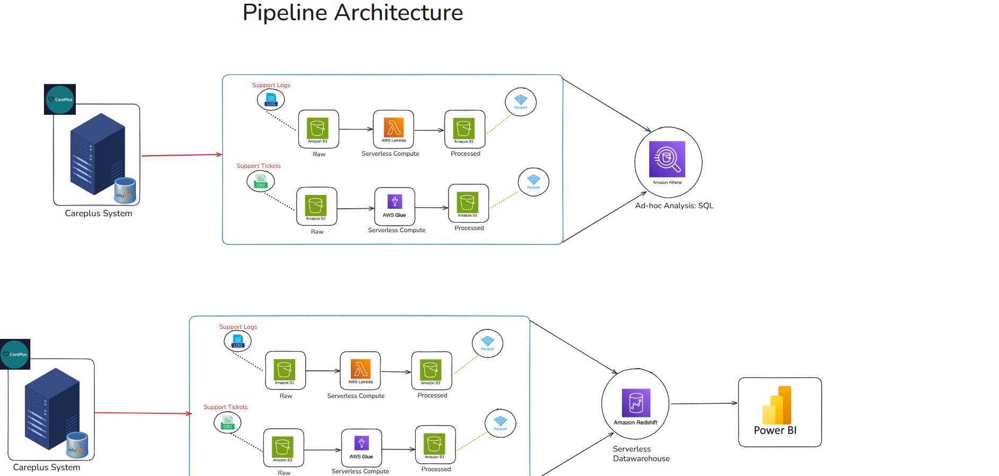
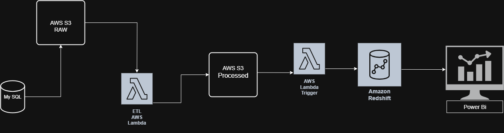
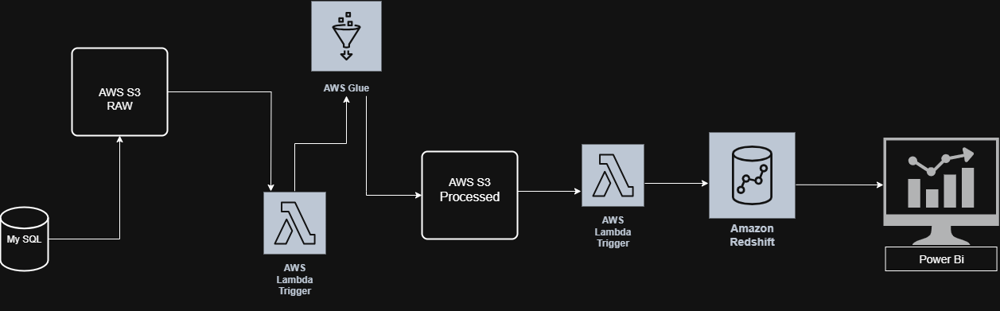
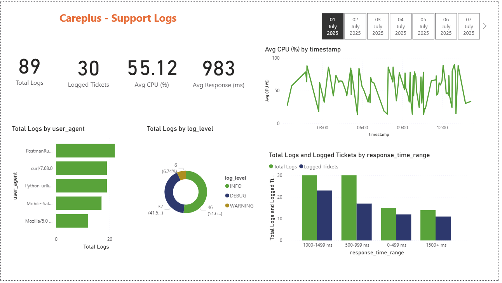
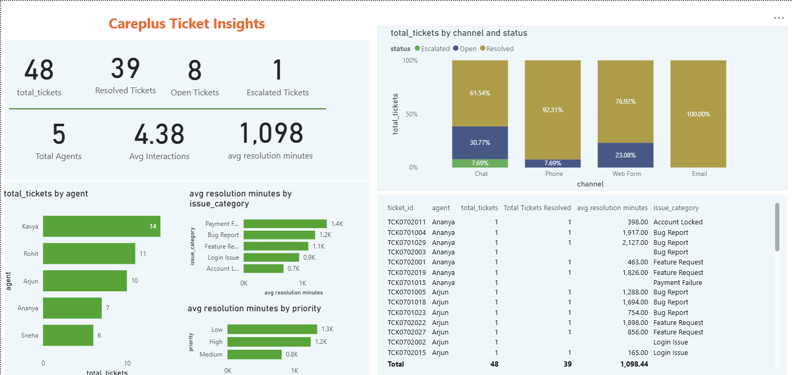

# CarePlus Support Tickets & Logs — AWS ETL & Analytics Pipeline

**Event-driven, serverless data pipeline for insurance support operations — from raw MySQL/log/CSV sources to a validated Redshift warehouse and a Power BI analytics layer.**

`AWS S3` `AWS Lambda` `AWS Glue (PySpark)` `Amazon Redshift Serverless` `Amazon Athena` `Power BI` `Python`

---

## Executive Summary

CarePlus is a self-built, end-to-end AWS data engineering pipeline that automates ingestion, cleaning, validation, and warehouse loading for two real-world insurance operations datasets — **support tickets** and **system support logs**. New files landing in S3 trigger fully automated ETL (Lambda for logs, Lambda + Glue PySpark for tickets), pass through a Data Quality gate, and are incrementally loaded into Redshift Serverless for Power BI reporting.

The pipeline was validated end-to-end with a live reconciliation test — a batch of **69 new records** moved the Redshift row count from **235 → 304**, and Power BI reconciled the same 69 records on the dashboard. The entire environment was built and **fully torn down after validation**, verified at **$0.00** in AWS Cost Explorer.

📄 **[Full Project Report](CarePlus_Final_Project_Report.docx)** — complete technical documentation including data models, DQ framework, operational runbook, alerting strategy, troubleshooting case study, and production roadmap.

---

## Table of Contents

- [Business Problem](#business-problem)
- [Objective](#objective)
- [Dataset](#dataset)
- [Tools & Technology](#tools--technology)
- [Workflow](#workflow)
- [Business Questions Answered](#business-questions-answered)
- [Key Insights](#key-insights)
- [Business Recommendations](#business-recommendations)
- [KPI Impact](#kpi-impact)
- [Business Impact](#business-impact)
- [Dashboard Preview](#dashboard-preview)
- [How to Run](#how-to-run)
- [Future Work](#future-work)
- [Author & Contact](#author--contact)

---

## Business Problem ⭐

Insurance support operations generate two continuous, structurally different data streams:

- **Support Tickets** — customer-facing issues (priority, agent, channel, interactions, resolution outcome)
- **Support Logs** — system-level events (log level, response time, CPU utilization, user agent)

Processed manually, this creates real operational cost: **delayed reporting, inconsistent cleansing, duplicate/invalid records, and slow root-cause identification** when something breaks in production. Analysts end up repeating the same cleanup work every time new data arrives, instead of spending time on analysis.

---

## Objective

Automate ingestion, transformation, validation, and warehouse loading end-to-end, so that new operational data becomes **analytics-ready within minutes** — with no manual intervention — and is immediately queryable in Power BI for both operations and management audiences.

---

## Dataset

| Source | Format | Frequency | Volume (validated batch) |
|---|---|---|---|
| Support Logs | `.log` (delimiter-separated, 14 regex-extracted fields) | Daily | 89 records/day (sample) |
| Support Tickets | `.csv` | Daily | 48 tickets/day (sample) |
| Source system | MySQL | — | Origin operational database |

---

## Tools & Technology

| Layer | Service |
|---|---|
| Storage | Amazon S3 (raw + processed zones) |
| Compute — Logs | AWS Lambda (Python 3.13, pandas) |
| Compute — Tickets | AWS Lambda → AWS Glue (PySpark, Visual ETL) |
| File Format | Parquet + Snappy compression |
| Data Quality | AWS Glue Data Quality (DQDL rules) |
| Ad-hoc Query | Amazon Athena |
| Warehouse | Amazon Redshift Serverless |
| Monitoring | Amazon CloudWatch |
| Security | AWS IAM (scoped users & roles) |
| BI | Power BI |

---

## Workflow

*End-to-end architecture — dual ingestion paths converge on a shared Parquet processed zone, then fan out to Athena for ad-hoc SQL and Redshift → Power BI for business reporting.*

View individual pipeline paths (Logs / Tickets)

*Support Logs — Lambda-only path.*

*Support Tickets — Lambda + Glue PySpark path.*

**Flow:** `MySQL / .log / .csv` → `S3 Raw` → `S3 Event Trigger` → `Lambda (Logs) | Lambda + Glue (Tickets)` → `S3 Processed (Parquet)` → `Data Quality Gate` → `Incremental Lambda` → `Redshift Serverless` → `Power BI`

---

## Business Questions Answered

- Which support channels generate the most tickets, and which escalate most often?
- What proportion of tickets remain unresolved at any given time?
- Which priority categories have the longest average resolution time?
- Which log levels dominate, and where are error events concentrated?
- Is CPU utilization correlated with response time?
- Are ticket volumes and response times trending in the right direction?

---

## Key Insights ⭐

- Sample-day dashboard: **89 total logs**, **55.12% avg CPU**, **983 ms avg response time**, with **30 tickets** logged against those events.
- Ticket Insights dashboard: **48 total tickets**, **39 resolved (81%)**, **8 open**, **1 escalated**, across **5 agents**, averaging **4.38 interactions** and **1,098 minutes** resolution time per ticket.
- **Email and Web Form** channels show the highest resolution rates; **Chat** has the highest escalation share — a direct operational signal for staffing/triage.
- End-to-end validation: a controlled batch of **69 records** was traced from S3 → Lambda → Parquet → Redshift (**235 → 304**) → Power BI (**69**) with no observed loss or duplication.

---

## Business Recommendations ⭐

- **Reallocate Chat-channel staffing** or add a triage step, given its disproportionately high escalation rate versus Email/Web Form.
- **Set an alert threshold on CPU utilization**, since it visibly spikes above 80–90% at multiple points in the sample window and correlates with response-time risk.
- **Prioritize automated DQ gating over manual review** for tickets with malformed structure — it already blocks bad data before it reaches Redshift, removing a manual QA step.
- **Extend the pipeline to Athena/Redshift dimensional modeling** once query patterns stabilize, to support faster cross-dataset (logs × tickets) reporting.

---

## KPI Impact ⭐

| KPI | Before (Manual) | After (This Pipeline) |
|---|---|---|
| Time to analytics-ready data | Manual, delayed | Automated, minutes after file arrival |
| Data validation | Ad hoc, inconsistent | Automated DQ gate (rejects/standardizes on ingest) |
| Warehouse load | Full manual reload | Incremental, event-triggered (+69 verified) |
| Troubleshooting | Difficult to trace | CloudWatch end-to-end traceability |

---

## Business Impact ⭐⭐⭐

- **Zero manual intervention** required from file arrival to Power BI-ready data — full automation across two independent data types.
- **100% reconciled validation** on the tested incremental batch (235 → 304 Redshift rows, 69 matched in Power BI), giving confidence the pipeline doesn't lose or duplicate records.
- **$0.00 net AWS cost** after project completion — full infrastructure teardown verified in Cost Explorer, demonstrating cost-conscious, serverless-first engineering.
- **Two production incidents diagnosed and resolved independently** (missing Lambda dependency via custom Layer), demonstrating real operational troubleshooting, not just pipeline construction.

---

## Dashboard Preview

*CarePlus Support Logs — daily-tab view, response-time and log-level breakdown.*

*CarePlus Ticket Insights — agent workload, resolution time, channel/status breakdown.*

---

## How to Run

> This project was built and executed via the AWS Console for hands-on learning; the steps below reflect the manual setup used. A scripted/IaC version is on the future-work list.

1. Create an S3 bucket with `raw/` and `processed/` prefixes for both `support-logs` and `support-tickets`.
2. Deploy the Lambda functions (`automate_support_logs_ETL`, `automate_support_tickets_etl`) with S3 event triggers on the relevant `raw/` prefixes.
3. Create the AWS Glue Visual ETL job (`automate_etl_support_tickets`) and the Glue Data Quality ruleset.
4. Deploy the incremental-load Lambda (with a `psycopg2` Lambda Layer) triggered on the `processed/` zone.
5. Provision Redshift Serverless and create the target tables.
6. Connect Power BI to Redshift and build/refresh the report.
7. Run the included ingestion notebooks (`support_logs_ingestion_to_S3.ipynb`, `support_tickets_ingestion_to_S3.ipynb`) to upload sample data and trigger the pipeline.

---

## Future Work

- Move Lambda/Glue source from the console into this repo with CI/CD (GitHub Actions).
- Add a dead-letter queue and event idempotency store for duplicate-safe processing.
- Automated alerting via CloudWatch Alarms → SNS.
- Migrate to a dimensional warehouse model (fact/dim tables) for faster BI queries.
- Restructure S3 to zone-first (`raw/` / `processed/`) layout for better partitioning at scale.
- Orchestrate with EventBridge + Step Functions for a production-grade V2 architecture.

*(Full breakdown in the [Project Report](CarePlus_Final_Project_Report.docx), Section 26.)*

---

## Author & Contact

**Sahajahanur Rahman Laskar (Sahajan)**
Data Analyst | Aspiring Data Engineer
5 years' insurance operations experience (MIS Executive, HDFC ERGO General Insurance, 2020–2025)

📧 connectingsrl@gmail.com
🔗 [LinkedIn](https://www.linkedin.com/in/sahajahanur-laskar/)
💻 [GitHub](https://github.com/Sahajahanur)
